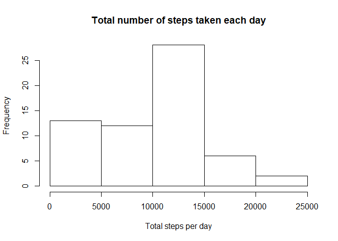
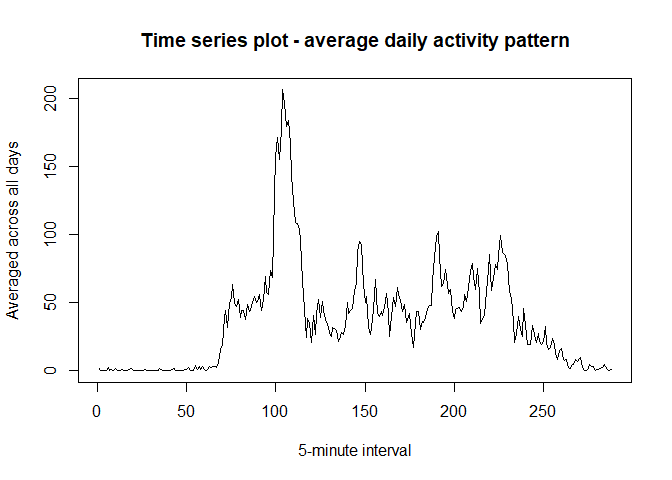
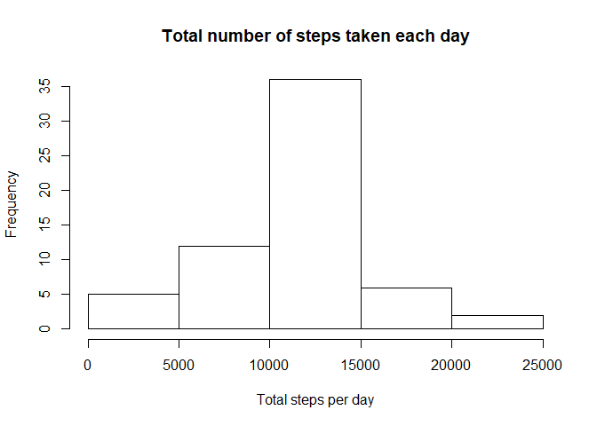
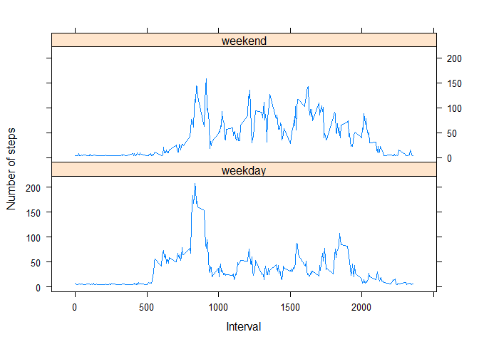

# Reproducible Research: Peer Assessment 1


## Loading and preprocessing the data

```r
data <- read.csv("activity.csv")
data$date <- as.Date(data$date, "%Y-%m-%d")
summary(data)
```

```
##      steps             date               interval     
##  Min.   :  0.00   Min.   :2012-10-01   Min.   :   0.0  
##  1st Qu.:  0.00   1st Qu.:2012-10-16   1st Qu.: 588.8  
##  Median :  0.00   Median :2012-10-31   Median :1177.5  
##  Mean   : 37.38   Mean   :2012-10-31   Mean   :1177.5  
##  3rd Qu.: 12.00   3rd Qu.:2012-11-15   3rd Qu.:1766.2  
##  Max.   :806.00   Max.   :2012-11-30   Max.   :2355.0  
##  NA's   :2304
```

```r
head(data)
```

```
##   steps       date interval
## 1    NA 2012-10-01        0
## 2    NA 2012-10-01        5
## 3    NA 2012-10-01       10
## 4    NA 2012-10-01       15
## 5    NA 2012-10-01       20
## 6    NA 2012-10-01       25
```


## What is mean total number of steps taken per day?

```r
steps_per_day <- aggregate(data$steps, by=list(data$date), sum, na.rm = TRUE)
names(steps_per_day) <- c("date","steps")
hist(steps_per_day$steps, main = "Total number of steps taken each day", xlab = "Total steps per day")
```

<!-- -->

```r
summary(steps_per_day)
```

```
##       date                steps      
##  Min.   :2012-10-01   Min.   :    0  
##  1st Qu.:2012-10-16   1st Qu.: 6778  
##  Median :2012-10-31   Median :10395  
##  Mean   :2012-10-31   Mean   : 9354  
##  3rd Qu.:2012-11-15   3rd Qu.:12811  
##  Max.   :2012-11-30   Max.   :21194
```
Mean of the total steps :

```r
mean(steps_per_day$steps)
```

```
## [1] 9354.23
```
Median of the total steps :

```r
median(steps_per_day$steps)
```

```
## [1] 10395
```

## What is the average daily activity pattern?
Make a time series plot (i.e. type = "l") of the 5-minute interval (x-axis) and the average number of steps taken, averaged across all days (y-axis)

```r
interval_avg <- tapply(data$steps, data$interval, mean, na.rm = TRUE)
plot(interval_avg, type = "l", xlab = "5-minute interval", ylab = "Averaged across all days", main = "Time series plot - average daily activity pattern")
```

<!-- -->

Which 5-minute interval, on average across all the days in the dataset, contains the maximum number of steps?

```r
names(which.max(interval_avg))
```

```
## [1] "835"
```
## Imputing missing values
Calculate and report the total number of missing values in the dataset (i.e. the total number of rows with NAs)

```r
sum(is.na(data))
```

```
## [1] 2304
```
Devise a strategy for filling in all of the missing values in the dataset. The strategy does not need to be sophisticated.
Create a new dataset that is equal to the original dataset but with the missing data filled in.

```r
mean(data$steps, na.rm = T)
```

```
## [1] 37.3826
```

```r
data_impute <- data
data_impute$steps[is.na(data_impute$steps)] <- mean(data_impute$steps, na.rm = T)
```

Make a histogram of the total number of steps taken each day and Calculate and report the mean and median total number of steps taken per day. Do these values differ from the estimates from the first part of the assignment? What is the impact of imputing missing data on the estimates of the total daily number of steps?

```r
data_impute_steps_per_day <- aggregate(data_impute$steps, by=list(data_impute$date), sum)
names(data_impute_steps_per_day) <- c("date","steps")
hist(data_impute_steps_per_day$steps, main = "Total number of steps taken each day", xlab = "Total steps per day")
```

<!-- -->

Mean of the total steps :

```r
mean(data_impute_steps_per_day$steps)
```

```
## [1] 10766.19
```
Median of the total steps :

```r
median(data_impute_steps_per_day$steps)
```

```
## [1] 10766.19
```
After imputing, the mean and median of the total steps are same.

## Are there differences in activity patterns between weekdays and weekends?
Create a new factor variable in the dataset with two levels - "weekday" and "weekend" indicating whether a given date is a weekday or weekend day

```r
data_impute$weekdays <- weekdays(data_impute$date)
data_impute$day[(data_impute$weekdays == "Saturday" | data_impute$weekdays == "Sunday")] <- "weekend"
data_impute$day[!(data_impute$weekdays == "Saturday" | data_impute$weekdays == "Sunday")] <- "weekday"
data_impute$day <- factor(data_impute$day)

data_impute_steps_per_days <- aggregate(steps ~ interval + day, data = data_impute, mean)
names(data_impute_steps_per_days) <- c("interval","days","steps")
```
Make a panel plot containing a time series plot (i.e. type = "l") of the 5-minute interval (x-axis) and the average number of steps taken, averaged across all weekday days or weekend days (y-axis). See the README file in the GitHub repository to see an example of what this plot should look like using simulated data.

```r
library(lattice)
xyplot(steps ~ interval | days, data = data_impute_steps_per_days, type = "l", xlab = "Interval", ylab = "Number of steps", layout = c(1, 2))
```

<!-- -->
